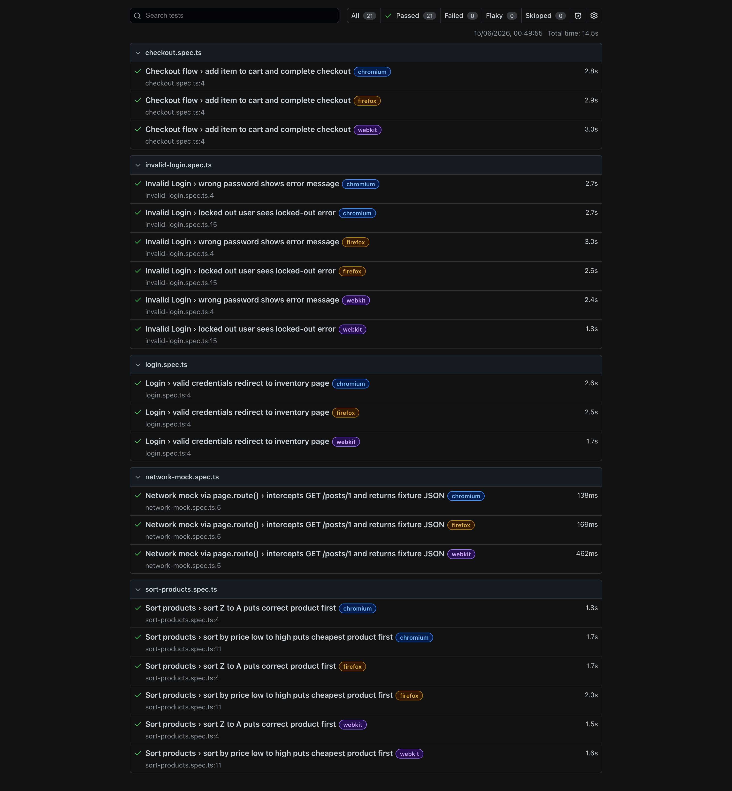
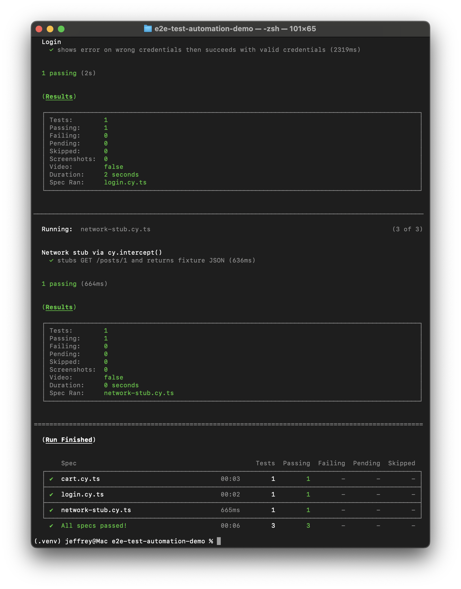

# e2e-test-automation-demo

A portfolio demo showing real, runnable end-to-end test automation across two frameworks and three languages. **Playwright (TypeScript)** is the primary suite, covering cross-browser flows with fixtures and network mocking. **Playwright (Python)** backs the Python competency claim. **Cypress** runs as a parallel subset with its own `cy.intercept()` stub. This is intentionally minimal and honest — not production-scale, but every test actually runs.

---

## Target application & API

| Target | URL | Why |
|---|---|---|
| Sauce Demo | `https://www.saucedemo.com` | Purpose-built test practice app with stable `data-test` attributes |
| JSONPlaceholder | `https://jsonplaceholder.typicode.com` | Free public REST API used for network-stubbing demonstrations |

---

## Requirements

- Node.js >= 20
- Python >= 3.12
- npm >= 9

---

## Install & run

### Playwright (TypeScript) — primary

```bash
npm install
npx playwright install
npx playwright test
```

Open the HTML report after a run:

```bash
npx playwright show-report
```

Run a single spec:

```bash
npx playwright test tests/login.spec.ts
```

---

### Playwright (Python)

```bash
cd playwright-python
pip install -r requirements.txt
playwright install
pytest
```

---

### Cypress

```bash
npm install          # already done if you ran the TS suite
npx cypress run
```

Open the interactive runner:

```bash
npx cypress open
```

---

## What's covered

### Playwright TypeScript specs

| Spec | Scenario |
|---|---|
| `login.spec.ts` | Valid credentials → lands on inventory page |
| `invalid-login.spec.ts` | Wrong password error · locked-out user error |
| `checkout.spec.ts` | Add to cart → full checkout flow → order confirmation |
| `sort-products.spec.ts` | Sort Z→A · sort price low→high |
| `network-mock.spec.ts` | `page.route()` intercepts `GET /posts/1`, returns fixture JSON |

### Playwright Python specs

| Spec | Scenario |
|---|---|
| `test_login.py` | Valid login → inventory page |
| `test_add_to_cart.py` | Add item → cart badge count |

### Cypress specs

| Spec | Scenario |
|---|---|
| `login.cy.ts` | Wrong credentials → error message · valid credentials → inventory page (single visit) |
| `cart.cy.ts` | Add to cart → cart badge · cart page shows item · checkout button visible |
| `network-stub.cy.ts` | `cy.intercept()` stubs `GET /posts/1` with fixture JSON |

**Fixtures & network stubbing:** The Playwright TS suite uses a custom `loggedInPage` fixture (`tests/fixtures/auth.fixture.ts`) to avoid repeating login steps across specs. Network mocking uses `page.route()` (Playwright) and `cy.intercept()` (Cypress) with the same stub payload at `tests/api-fixtures/posts.json` / `cypress/fixtures/posts.json`.

---

## Project structure

```
e2e-test-automation-demo/
├── playwright.config.ts          # chromium, firefox, webkit + HTML reporter
├── cypress.config.ts
├── package.json
├── tsconfig.json
│
├── tests/                        # Playwright TS specs
│   ├── fixtures/
│   │   └── auth.fixture.ts       # logged-in page fixture
│   ├── api-fixtures/
│   │   └── posts.json            # network-mock stub payload
│   ├── login.spec.ts
│   ├── invalid-login.spec.ts
│   ├── checkout.spec.ts
│   ├── sort-products.spec.ts
│   └── network-mock.spec.ts
│
├── playwright-python/            # Playwright Python specs
│   ├── requirements.txt
│   ├── conftest.py
│   ├── test_login.py
│   └── test_add_to_cart.py
│
├── cypress/                      # Cypress specs
│   ├── e2e/
│   │   ├── login.cy.ts
│   │   ├── cart.cy.ts
│   │   └── network-stub.cy.ts
│   └── fixtures/
│       └── posts.json
│
├── .github/
│   └── workflows/
│       └── ci.yml                # Playwright TS + Cypress on push/PR
│
└── docs/
    ├── playwright-report.png
    └── cypress-run.png
```

---

## CI

GitHub Actions runs the Playwright TS and Cypress suites on every push and pull request. The Playwright HTML report and Cypress artifacts are uploaded as workflow artifacts.

---

## Screenshots

### Playwright HTML report


### Cypress run

